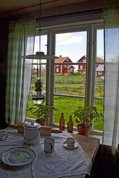

## What is it?

The electronic window is a free software project,

The e-window is part of a multi-level connectivity system between shared working environments: the [Multifactory Network.](MultiFactory.html)

The "electronic window" is a direct way to establish connections between people who work in different cities. Just imagine a window trough the wall. You just go to the coffee-break area, or to the café, and you can see other people from another space, talk to them, exchange ideas, give and get suggestions on what you’re doing. In every space which is part of the network there is a window.

The EWindow is an attempt to understand internet video telephony,
building a new decentralized, encrypted 24/7 audiovisual bi-directional link --> A Window

## How does it work?

Each window can be opened on another one, but just one connection can be&nbsp; established for each pair of windows (nevertheless, it’s possible to&nbsp; choose another space just pushing a button).

Each&nbsp; e-window is open all day long from one space to another one. If there&nbsp; are two persons close to the two windows, they can talk and interact.

E-windows&nbsp; are based on low-cost technologies (Raspberry Pi, a flat monitor, a&nbsp; webcam, Linux and a few other electronics) and are intended to be just&nbsp; e-windows: they don’t have keyboard, mouse, browser, and other programs&nbsp; installed.

If people want to meet in front of the window, they act exactly as if they would plan to meet someone at the bar:

A&nbsp; – meet people by chance: you go, take a coffee, and start talking to&nbsp; someone you don’t know, or someone you know and is taking a coffee at&nbsp; the same time

B – you send a message to someone and just say “see you in 5 minutes at the e-window”

People can meet and start business relationships as well. In what differs&nbsp; compared to a skype call? To make a skype call, you have to ALREADY know&nbsp; who you are calling, you need their contact, and so on. With the&nbsp; electronic window, you can easily interact with people you never met&nbsp; before (but maybe who you think could be interesting, because you’ve seen their video-tutorial-presentation).

the typical CASE di RINGHIERA, in North Italy. Every window is one in front of the other one and interaction is much more than in a flat.

## How is it implemented?
### Why don't you just use WebRTC?

# The Goal

[Learn more about the multifactory network...](MultifactoryModel)

# / Our values

We strongly believe that a free software communication platform is
really needed to protect freedom of speech and e-democracy.
Commercial software which you can use for free is not a gift. It’s a Trojan horse.
Systems based on proprietary code leave users unprotected and their centralized architectures expose people and  their data.
So, for us is mandatory to have a free and open system and we understood
that it can only be developed by a huge and diversified group of developers.
The goal is not just to have a videochat system for Makerspaces and FabLabs, but to increase the security
and to protect the freedom of all of us.

# How to become part of the network?

# What

# Features

- SIP Video Soft-Phone implementation based baresip/libre sip stack
- Audio codecs: Opus, PCM/8000, Speex
- Video codec VP8/VP9 (PC), H.264 (Pending RPi HW Implementation)
- BSD-licensed codebase, lean, modular C codebase
- Supports Raspberry Pi hardware-accelerated video output (OpenMAX)
- Command Line Interface

# Documentation

The documentation is mostly unwritten, our outdated.
These Links point to pad dumps, mostly old development notes that need
to be converted into a useful manual, step-by-step

- [Part 1 - Network Architecture](manual/EWindow-1)
- [Bill of Materials](manual/EWindow-BOM)

# DevLog

[Notes of using baresip with WebRTC Client](devlog/EWindow-7-WebRTC)

Development  
===========

The development of ewindow is focussing on two parts:

1) Baresip extensions for Raspberry Pi

    git clone https://github.com/eleKtronicwindow/baresip

2) Integration and User Interface scripting

	The plan is to build a native Raspberry Pi Application
	based on lib[baresip](https://github.com/alfredh/baresip)

This repository is points to a bunch of install/setup scripts,
starting from Raspbian Jessie Lite former
[daemontools](https://cr.yp.to/daemontools.html) scripts example configs and :

    git clone https://github.com/strfry/ewindow

3) WebSite and Documentation

    git clone https://github.com/eleKtronicwindow/eleKtronicwindow.github.io

## MakeMunich Cluster

There is a different development line based on WebRTC with modern browser.

[https://github.com/munichmakerlab/ewindow_webrtc]

It is told to run on Raspberry Pi 3 with Chrome and tolerable performance.

Backlog / Challenges
====================

* Fix up WebRTC <> baresip interaction -> [WebWindow]
* Using the native Raspberry Pi VideoCore4 HW Acceleration with OpenMAX
** Write a raspicam camera driver
** Integrate H264 decoder in omx module
* Security
** Generate PeerVPN config with PSK from end-user dialog
* Audio
** Real-Time/Latency
** Accoustic Echo Cancellation
** CPU Load of Opus codec
** USB Speakerphones (Plantronics 610, Jabra 410) currently crashing into Raspi's tiny USB Host
*** TODO: Try on FreeBSD
** Interaction with SIP hardware phones?
*** IDEA: Use the Raspberry Pi (1) as a video-adding proxy on a ip phone
** Hardware design of Raspi I2S Speakerphone Hat?

Download  
========

The finished SD Card Image is not available yet.

Preview Alpha 0.2 from 20th April 2017 can be downloaded here:
http://ewindow.org/ewindow-v0.2-20Apr17.zip

ATTENTION: This version is not secure yet. The access keys are stored on Github. It might potentially compromise your network!
Regard it as experimental.
Help in making the VPN more secure and functional would be super-welcome.
Please contact us if you want to help building a Continous Integration environment. 
See [teilWERK/Image] for instructions, how this image was built from Raspbian Lite on a QEMU-ARM System.

Contact
=======

Jonathan Sieber - mail@strfry.org
